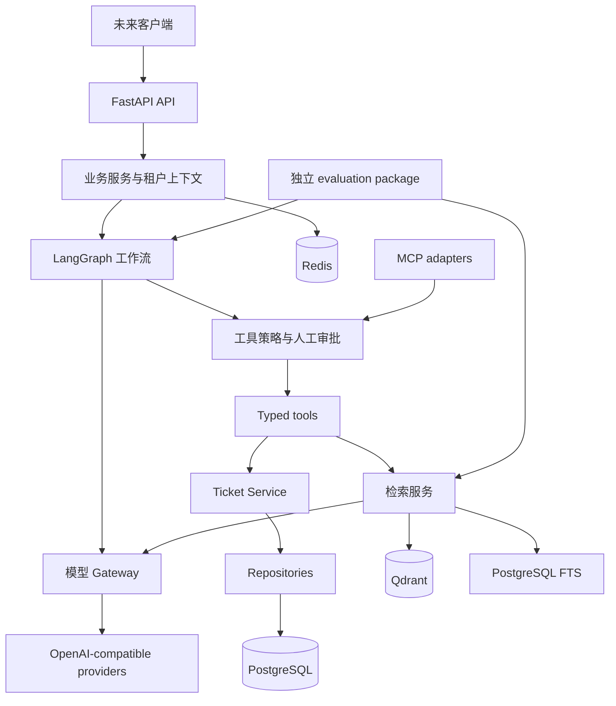

# AgentOpsHub Architecture

Evaluation-driven enterprise Agent runtime/orchestration platform; SupportOps and DataCopilot reference scenarios.

## 1. 状态与边界

当前实现范围为 **Phase 0–7A：Bootstrap、Persistence、内部 LLM Gateway、Tool Runtime、Bounded Agent Runtime、Knowledge Ingestion、Lexical Retrieval/Evaluation、Bounded Knowledge Context/Agent Loop**。本文区分现有实现与目标设计；
设计中的模块、表、接口和保障不代表已实现。项目是 production-oriented 原型，
已实现 Tenant/Ticket 持久化，已实现内部有界 Agent；尚不具备认证或生产部署能力。

约束：原创实现，不复制已有项目代码；Windows 11 + Docker Desktop；Python 3.12+；
16 GB RAM 开发机不强依赖本地大型模型；所有模型访问经 OpenAI-compatible abstraction；
API key 不入库、不写日志、不进 Git；性能或质量数字必须有可重复的实验依据。

## 2. 架构选择

先采用模块化单体，保持清晰接口与单向依赖，之后按真实负载决定拆分。
HTTP API 只处理鉴权上下文、输入校验和协议转换；service 定义业务操作与事务；
repository 执行持久化。Agent orchestration 依赖工具和 gateway 接口，不直接访问数据库。
FastAPI 在组合根 main.py 中装配实际适配器。



图为目标架构。当前 API 提供 /health 与 PostgreSQL /ready；Tenant/Ticket 持久化通过内部 repository 使用，尚无业务 HTTP 路由；内部 Gateway 的模型连接通过离线 transport 验证，未实际调用模型。

## 3. 当前实现

- `create_app(settings=None)`：显式配置快照和 lifespan，无导入时网络 I/O。
- `/health`：liveness，返回 status/service/version；不访问 PostgreSQL、Redis、Qdrant、LLM。
- Pydantic settings：构造参数 > 环境变量 > 根目录 .env > 默认值；无全局缓存，便于隔离测试。
- 配置非法时启动失败，错误文本不包含原始配置输入；生产模式禁用 API 文档页面。
- ASGI middleware：服务端生成 UUID 请求 ID，响应附带 X-Request-ID；不信任传入 ID。
- JSON 日志：UTC 时间、级别、logger、固定事件、请求 ID、路由模板、耗时、状态或异常类型。
  不输出原始路径、query、headers、body、任意日志消息或 exception traceback。
  未知第三方日志转为通用 log 事件；排障信息有限是目前明确的取舍。
- 500 响应不泄漏异常文本，使用 request_id 关联日志；请求上下文在 finally 中清理。
- uv、pytest、Ruff、strict mypy、pre-commit、跨平台脚本和 CI 工作流配置。

## 3a. Phase 1 本地运行时与持久化（已实现）

Conda 环境 agentopshub 提供 Python 3.12；environment.yml 仅声明运行时。
依赖由 pyproject.toml + uv.lock 唯一管理。uv 0.12.10 的 dry-run 和实际安装均验证了
UV_PROJECT_ENVIRONMENT=sys.prefix 配合 --locked --inexact --python=sys.executable
--no-python-downloads 会安装到当前 Conda 环境。--inexact 保留 Conda 引导包，
不会清除锁外残留；依赖移除时需要单独审查。禁止向 base 或系统 Python 同步。
scripts/dev.py 通过当前解释器 -m 调用工具，避免裸 uv run 重新选择 .venv。
旧 .venv 在完整 Phase 0 回归、解释器/包路径和 HTTP 启动验证后移除。
CI 继续使用标准 Python + uv 临时虚拟环境，不依赖 Conda，不写绝对安装路径。

```text
FastAPI lifespan → Database → one AsyncEngine + async_sessionmaker
request/service → Database.transaction() → AsyncSession.begin()
→ TenantRepository / TicketRepository → PostgreSQL
```

Settings 复用 POSTGRES_* aliases，password 是 SecretStr，URL.create 负责安全转义。
缺失密码时 engine 不配置，/health 可用而 /ready 返回 503；配置错误仍启动失败。
创建 engine 不建立连接；连接池只在实际操作时访问 PostgreSQL。pool_pre_ping 检测过期连接，
pool checkout/connect/command timeout 与 readiness 总 deadline 均有显式上限。
关闭 lifespan 时 await engine.dispose()，不是每个请求创建 engine。

事务采用简单服务/请求边界：Database.transaction 使用 async_sessionmaker.begin，正常退出提交，
异常回滚并关闭 session；SQLAlchemy 异常只记录类型后传播，不在 repository 中吞掉约束错误。
Repository create 仅 flush；更新/删除在当前事务内执行，不调用 commit。
TransactionSession 是 FastAPI function-scoped dependency，响应发送前完成事务退出；
同一个 AsyncSession 不得被并发任务共享。未引入额外 Unit of Work 类。

| 模型 | 字段及约束 |
| --- | --- |
| tenants | UUID PK；slug VARCHAR(100) UNIQUE NOT NULL；name VARCHAR(200) NOT NULL；非空白检查；created_at/updated_at TIMESTAMPTZ |
| tickets | UUID PK；tenant_id NOT NULL FK tenants ON DELETE RESTRICT；title VARCHAR(300) NOT NULL 非空白；description TEXT NOT NULL 默认空串；status/priority；两个 TIMESTAMPTZ |

UUID 由 Python uuid4 在 INSERT 时提供，不依赖数据库扩展；原始 SQL 插入需显式给出 UUID。
created_at/updated_at 默认数据库 CURRENT_TIMESTAMP；BEFORE UPDATE trigger 使用 clock_timestamp()
维护 updated_at，覆盖 ORM 和直接 SQL 更新。模型使用 server_onupdate/eager_defaults 读取返回值。
tenant slug 区分大小写；本阶段不添加业务 slug 规范化或状态转换策略。

TicketStatus/TicketPriority 是 Python StrEnum，SQLAlchemy Enum(native_enum=False,
create_constraint=True, validate_strings=True) 保存 enum.value；PostgreSQL VARCHAR + CHECK
阻止直接 SQL 写入未知值。值域是 open/in_progress/resolved/closed 与 low/medium/high/critical。
此策略没有 PostgreSQL enum TYPE 的创建/删除生命周期，降级更直接，存储更可移植；
未来新增/删除枚举值仍需显式约束迁移，删除值前必须迁移已有数据。

Metadata 为 PK/FK/UQ/IX/CHECK 设置确定命名；Ticket 有 ix_tickets_tenant_id 和
ix_tickets_tenant_id_status。外键 RESTRICT 避免删除租户时默默丢失工单。
TicketRepository 不存在 get(ticket_id)；每个读/改/删 SQL 同时过滤 tenant_id 和 ticket_id，
列表过滤 tenant_id 并限制分页；create 强制设置 tenant_id。更新 API 不允许改变归属。
隔离测试先加载 B 的对象到 identity map，再证明 A 不能读取、修改或删除，并用新 session
确认 B 的记录未改变。它是应用级隔离，不是认证授权或 RLS；调用者仍须提供可信租户上下文。

Alembic revision 20260908_01 原创定义表、约束、索引、时间戳触发器；启动不执行 create_all。
env.py 使用 Settings + AsyncEngine/NullPool，run_sync 进入 Alembic 同步操作并 finally dispose。
离线 SQL 不需要凭据。upgrade/current/downgrade/re-upgrade 与 alembic check 已在空测试库验证。
Alembic check 不自动检测 trigger body 漂移，触发器语义由实际 SQL 测试验证。

/health 保持进程 liveness 与既有响应契约。/ready 用 SELECT 1 检查 PostgreSQL，
成功 200，超时/连接失败/未配置 503；返回固定 status/dependencies，不泄漏连接细节。
Redis/Qdrant 不参与应用 readiness。SELECT 1 不代表 schema 已迁移，发布流程必须单独检查迁移。

集成入口创建唯一 Compose project 和 agentopshub_test_<随机 run ID> 数据库，使用随机密码、
回环临时端口、tmpfs，不采用开发 DSN。fixture 校验命名，独占串行清理测试表，允许真实事务提交。
迁移往返与约束/回滚/跨租户测试使用真实 PostgreSQL；之后实际启动 Uvicorn，并停止同一 run-owned
测试容器，验证 /ready 503 与 /health 200。finally 清理仅由本次创建的资源。
运行原始结果保存在忽略的 .artifacts；progress.md 记录真实摘要，不将测试耗时作为性能结论。

Phase 1 之后新增的 Gateway 见第 7 节；Phase 7A 已接入内部 knowledge retrieval/context loop。MCP、认证、frontend、Redis/Qdrant 业务逻辑仍未实现。

## 4. Bounded LangGraph 1.2 Agent Runtime (implemented)

LangGraph is orchestration, not the application framework. Custom StateGraph preserves
provider/business contracts. High-level create_agent, MessagesState and LangChain message
classes would transfer ownership or require unnecessary adapters, so they are not used.
The Gateway Protocol describes existing generate behavior; no second gateway/client is created.

Construction compiles START -> model_turn -> END / execute_tools -> model_turn once.
Lifespan reuses Gateway/Registry/Executor resources. Compilation is local and zero-provider
startup works. AgentRuntime.run maps private graph output to AgentRunResult, so extra
input/output graph schemas add no boundary value. No public execution endpoint exists.

AgentState is a TypedDict: messages, route, pending_tool_calls, executed_tool_call_ids,
model_turn_count, tool_calls_seen, tool_executions, successful_tool_count, failed_tool_count.
Nodes return replacement values; copied tuples/frozensets avoid reducer double-appending.
State initializes independently per run, including concurrent runs on the same graph.
Phase 2 Message/ToolCall/LLMRequest/LLMResponse remain authoritative.

Trusted context is a frozen dataclass validated/snapshotted through ToolExecutionContext:
tenant_id: UUID, tool_policy: ToolExecutionPolicy, optional request_id: UUID.
context_schema injects Runtime[AgentRunContext].context; deprecated config_schema is not used.
Trusted tenant/policy never enter mutable state. Dependencies remain outside state.
AgentRunRequest contains only user_message and route, without prior conversation or limit
overrides. Authentication remains future work; callers must provide trusted server context.

model_turn checks semantic budget before Gateway invocation, forwards registry definitions
and correlation, and retains assistant output. Only tool-free finish_reason stop completes.
execute_tools constructs ToolExecutionContext solely from runtime.context, and dispatches
only through ToolExecutor. Nodes never call repositories, handlers or provider HTTP directly.
Existing strict schemas reject tenant_id/allow_writes injection. ToolResult maps explicitly
to a tool-role Message with matching call ID: validated business data or semantic error
category/fixed message. Ordinary safe tool errors permit bounded model recovery.

Semantic budgets and duplicate rules:

- Trusted construction-time AgentLimits defaults: M=8 model turns, C=16 requested calls,
  60 seconds overall. M is 1..100, C 0..100, timeout (0, 3600]. These ceilings also fit the
  existing Gateway's 500-message contract; no ContextEngine token budget is implied.
- model_turn_count counts calls to generate, excluding provider retries/fallback.
  tool_calls_seen counts all model-proposed calls including duplicates.
  tool_executions counts Executor dispatches, including validation/policy rejections.
  Successful/failed counts classify returned Executor results; duplicates count in neither.
- Whole-batch budget validation precedes any side effect. Oversized batches execute none.
  Duplicate IDs within the same new batch also reject the whole batch before dispatch.
- Previously dispatched IDs return duplicate_tool_call without re-execution, even after
  failed ToolResult. Other new IDs in a valid batch execute sequentially.
  The processed-ID set exists only inside one run.
- Same logical write under another ID or another run can still duplicate records.
  This is not business idempotency; persistent keys/execution ledger require later design.
- Explicit recursion_limit = 2*M+2 permits M model nodes, M tool nodes, the next model
  budget rejection node and END headroom. Semantic budgets are authoritative. Tests use multiple M values and verify that actual graph semantic budget errors stop first.
  No framework default is relied on (installed LangGraph default differs from langchain-core).
  A deliberately too-small limit triggers real GraphRecursionError, mapped to safe
  AgentRuntimeError with diagnostic category recursion. No limit adjustment/retry occurs.

One outer asyncio.timeout covers all of ainvoke, Gateway attempts and tool rounds.
Own expiry becomes AgentDeadlineExceededError; external CancelledError propagates unchanged,
with no subsequent calls. Unrelated TimeoutError remains a runtime failure.
There is no LangGraph RetryPolicy, cache, error-handler retry or additional node timeout.
Gateway owns provider retries/fallback; Executor owns per-tool timeout and never retries.
Ambiguous WRITE completion must never trigger graph replay.

Tools and tool-result messages follow model order. Each tool retains its own transaction:
multi-tool batches are not globally atomic. Later failure cannot roll back an earlier commit.
Failed writes retain service validation-before-commit and rollback. Cancellation is cooperative
and cannot undo a committed write. Persistent/resumable execution is not claimed.

Only COMPLETED returns AgentRunResult with final_message, messages, five counters and
monotonic duration_ms. Typed configuration/budget/deadline/model/protocol/runtime exceptions
have fixed safe messages; fatal failures do not return partial state/counters.
Unexpected framework details, repr or traces never enter model messages or Agent logs.
Safe Executor failures remain recoverable; broken graph invariants do not.

Fixed Agent log events: start, model turn, tool round, finish, error. Metadata includes
request ID, counters, duration, safe category; not prompts, assistant bodies, tool arguments,
ToolResult bodies, ticket descriptions or arbitrary route/name strings. Debug/print streaming
is disabled. Required transitive LangSmith is used only for tracing_context(enabled=False);
no external tracing integration/client is configured. Scoped disabling also handles inherited
tracing opt-in without mutating the environment. trace_policy is unset, not a redaction
mechanism. execution_info is unused and never part of security.

No checkpointer, Store, InMemorySaver, persistent memory, interrupts, resume, HITL,
LangGraph Server or external observability is configured. Related transitive packages do
not imply enabled features.

Future integration points and remaining boundaries:

- Phase 7A `KnowledgeContextAssembler` packs bounded retrieved evidence. A generic multi-source
  ContextEngine may later prepare other normalized messages before model_turn.
- Memory Manager may supply authorized context through a future explicit history boundary.
- Agent Skills may contribute reviewed instructions/tools through composition.
- MCP adapters may register typed tools while preserving Executor authorization.
- OpenTelemetry may consume safe run/turn/tool metadata in its own future phase.
- Live-model knowledge quality, reflection, multi-agent, A2A, AG-UI, public API and local models remain unimplemented or unmeasured.

Offline tests script Gateway and execute actual compiled StateGraph. Full-path integration
retains real Executor, TicketService, TicketRepository and isolated PostgreSQL. SQLAlchemy
before_commit failure injection tests actual flushed-write rollback without mocking those layers.

## 5. Typed Tenant-Safe Tool Runtime（Phase 3 已实现）

```text
Agent / LLM ToolCall + trusted ToolExecutionContext
  → ToolExecutor → ToolRegistry.lookup
  → Pydantic input validation → effect / write policy
  → bounded async handler → TicketService → tenant-scoped Repository → PostgreSQL
                         → injected database.ready check (system_status)
  → output validation → safe ToolResult + metadata-only logs
```

### 协议、契约与注册

LLM 包拥有 ToolDefinition/ToolCall 的协议表示；tools 包拥有实际执行。Gateway 从不调用
ToolExecutor 或 repository。注册工具用 Pydantic `model_json_schema()` 生成现有 ToolDefinition，
`ToolRegistry.llm_definitions()` 可直接供 LLMRequest.tools 使用，不维护第二套 wire schema。

不可变泛型 dataclass `Tool[Input, Output]` 绑定 name/description/input_model/output_model/
effect/timeout_seconds/异步 handler。输入继承严格 ToolModel；输出为明确 Pydantic model。
`RegisteredTool` Protocol 仅擦除异构注册时的泛型差异，handler 内保留具体输入输出类型。
名称使用 `[a-z][a-z0-9_]{0,63}`，小写字母开头、最长 64。期限必须有限且在 (0, 300] 秒内。
Registry 提供 register/lookup/list_tools/llm_definitions；重复抛 ValueError 并保留原工具，
缺失抛 ToolNotFoundError，列表为按名称排序的 tuple。每次导出的 schema 独立，修改它不改变工具。
注册只允许应用显式绑定可信代码；没有扫描、动态 import、MCP discovery 或任意函数名调用。
READ_ONLY 是可信 handler 的声明，不是沙箱；新增 handler 必须审查副作用是否与声明一致。

### Executor 生命周期、可信上下文与校验

入口 execute(call, context) 接收既有 normalized ToolCall。Phase 2 已解析 JSON object；
executor 仍校验参数对象形状并执行输入模型的严格 JSON 验证。JSON UUID/枚举字符串有效，
错误类型、缺字段、非法枚举、非有限 JSON 数值、未知字段失败。禁止任意 dict 直通仓储。
输出重新验证并 JSON 序列化，只返回符合输出契约的数据；非法输出映射 result_validation。

`ToolExecutionContext` 为 frozen Pydantic 模型，必须有真实 UUID 类型 tenant_id，
可选 UUID request_id，以及 ToolExecutionPolicy。上下文在执行前重新验证，缺失/伪造类型
是调用方编程错误并直接拒绝；认证本身尚未实现。Agent 的服务端调用方负责构造上下文，
不能将模型内容反序列化成 context，也不能让模型指定 policy。
tenant_id 不在 ticket 输入 properties 中，extra=forbid 阻止注入；创建也拒绝 id、时间戳。
ticket_id 只是搜索条件，始终与 context.tenant_id 组合成仓储谓词，猜测 B 的 UUID 不会越权。

执行顺序：解析已注册名称 → input validation → READ_ONLY/WRITE 判定 → policy →
async handler（带可信 context）→ output validation → ToolResult。
allow_writes 默认为 False；WRITE 在服务调用和打开数据库事务前抛 ToolPolicyError，
READ_ONLY 正常允许，不实现 scopes/RBAC/HITL/权限降级。context 不含可执行对象或模型可选依赖。

### 服务、内置工具与事务

main.py lifespan 使用同一个 application Database，通过 build_tool_registry 显式组装三个工具，
再创建 app.state.tool_executor。没有新 HTTP 路由；健康检查与 Gateway 生命周期保持原语义。
system_status 注入 async bool checker，实际为 Database.ready，输出仅 application/postgresql，
没有 HTTP endpoint 耦合、主机信息、可选 URL、shell 或秘密配置。

ticket_search 接受 status、limit（默认 20，1–100）和可选精确 ticket_id；不提供 priority 过滤。
TicketService.search 使用每调用独立 Database.sessions session，正常结束关闭/回滚读事务，
从不 commit。list/get_by_id 复用既有仓储，所有路径显式传入可信 tenant_id。
精确 ID 结合 status 过滤；他租户/不存在 ID 统一空列表。

ticket_create 输入 title（非空白、最多 300）、description（最多 10000）、priority。
status 固定初始 open，UUID/时间戳由既有持久化实现生成。TicketService.create 持有
Database.transaction，repository 仅 flush；TicketView 在事务内构造验证，然后事务退出提交。
输出摘要只含 id/title/status/priority，不含私有描述、tenant ID 或 ORM 实例。
异常、DTO 构造失败和取消会回滚未提交写入，executor 不持有事务也不提交 READ_ONLY 工具。
服务内部 DTO 构造失败作为 execution 失败归一化；handler 返回不符声明的对象为 result_validation。
后续新增写 handler 必须在提交前完成其业务输出验证，executor 的最终校验不能撤销已提交副作用。

### Deadline、取消与重放

`asyncio.timeout` 包裹 handler（包括 DB 事务退出）和输出验证；通用默认 10 秒、status 5 秒。
使用 perf_counter 单调时钟记录整次调用 duration_ms。协作式异步 handler 必须及时 await，
不得阻塞循环或吞 CancelledError；本层不提供进程隔离/强制终止任意 Python 的功能。
外部 CancelledError 写取消元数据后原样传播，不转换成功/失败结果，不启动后台重试任务。
executor deadline 到期为 timeout；handler 自己抛出的 TimeoutError 为 execution，避免误判本层期限。

Executor 从不自动重试，包括 WRITE。没有 idempotency key 或分布式去重；相同 call ID 再调用
仍会再次执行。DB commit 附近超时、取消或断连可能造成完成状态未知，即使错误也不可声称必定回滚。
未来 Agent 应避免自动重放 WRITE，并在引入幂等协议后单独验证恢复语义。

### 错误与隐私日志

ToolError 派生 ToolNotFoundError、ToolInputValidationError、ToolPolicyError、ToolTimeoutError、
ToolExecutionError、ToolResultValidationError。ToolResult 包含 tool_call_id、tool_name、success、
data、error(category/message)、duration_ms；成功必须有 data 且无 error，失败恰好相反。
消息使用固定词表，不转发 exception repr、Pydantic error detail、SQL、数据库 URL、密钥或 traceback。
工具 data 不出现在 ToolResult repr。ToolCall 的名称/ID 仍在结果中用于关联，但不视为可信日志字段。

沿用 JsonFormatter 事件/字段 allowlist，增加 tool_start/tool_result/tool_error、已注册 tool_name、
tool_effect、tool_outcome、tool_error、duration_ms。request ID 取显式可信 UUID，否则继承服务端
request_id_context；不覆盖/污染调用方 contextvar。不记录 tenant ID、call ID、未知名称、原始参数、
工单标题/描述、输出正文、数据库异常或 Authorization/API key。取消输出 tool_error/outcome=cancelled。
尚无 tool_execution 表、持久化 traces 或外部审计系统。

### 验证与未来适配边界

离线 handler 测试 registry、schema、严格校验、effect/policy、输出、固定错误、取消、期限和日志。
真实 PostgreSQL 测试两租户 list/精确 ID 隔离、输入注入拒绝、限量/状态过滤、只读零 commit、
拒绝写零事务、创建归属、flush 后异常/超时/取消/DTO 失败回滚、commit 失败、其他租户记录完整。
保留原迁移、仓储隔离、LLM transport/gateway、/health、/ready 回归；无外部模型请求。

Phase 4 LangGraph 只应调用 gateway 和 executor，不从 graph node 访问 repository；应限制步数、
总时长和工具调用数，保持 trusted context，传播取消，消费分类结果并禁止自动重放 WRITE。
Phase 7A 已显式注册 READ_ONLY `knowledge_search`，复用 Tool/ToolRegistry/ToolExecutor 和
KnowledgeRetriever。租户与 namespace 从 trusted runtime context 传入，PostgreSQL 在 SQL 内授权隔离。
未来 MCP adapter 只做协议/认证上下文转换并复用 runtime/policy，不能绕过写策略或导入任意工具。
MCP、raw SQL 工具、认证、HITL UI 和持久化 tracing 均未实现。
raw SQL 需要单独设计解析、租户约束、只读角色、表/语句白名单、期限/行数与审计，不在本阶段注册。

## 6. Deterministic knowledge ingestion and lexical retrieval (implemented)

Workflow First, Agent When Necessary. Deterministic where possible. Agentic where
necessary. Hybrid by design. Models propose; deterministic systems validate, authorize
and execute. No complexity without measurable value. Each substantial technology must
answer problem, simplest baseline, baseline insufficiency, classification, complexity,
failure modes, measurable metric, experiment, rejection condition and replaceability.
[Phase 5 decision](docs/decisions/0001-deterministic-knowledge-ingestion.md) answers this
gate for the parser, chunker, storage model, limits and concurrency strategy.

AgentOpsHub owns the platform/runtime/orchestrator/harness foundation. SupportOps owns
support-domain workflows and agents; DataCopilot owns data-domain workflows and agents.
Separate deployment, ownership, tests and versions justify separate repositories.
[SupportOps](docs/scenarios/supportops.md) and [DataCopilot](docs/scenarios/datacopilot.md)
define deterministic, agentic and hybrid responsibilities; source is not copied here.
Future boundaries: tools/data via MCP, independent domain agents via A2A, frontend via
AG-UI. All three are documentation only and require later independent adoption gates.

```text
Trusted context (tenant + namespace + optional request UUID)
 + DocumentInput (logical source_key, title, media_type, bytes)
 -> byte validation -> strict UTF-8 -> conservative normalization
 -> ATX heading/fence scanner -> normalized SHA-256
 -> Database.transaction -> upsert + scoped row lock -> latest revision check
 -> UNCHANGED, or deterministic chunks -> provenance -> revision/chunks -> commit
```

All ingestion stages are deterministic; no graph node, Gateway call or ToolExecutor
participates. The public API still contains only existing health/readiness behavior.
Knowledge corpus presence is neither liveness nor database readiness.

| Table | Identity, snapshots and constraints |
| --- | --- |
| knowledge_documents | UUID PK, tenant UUID FK RESTRICT, namespace, source_key, current title/media_type, created_at/updated_at TIMESTAMPTZ; unique tenant/namespace/source_key; key/namespace/media/title CHECKs |
| knowledge_document_revisions | UUID PK, document FK RESTRICT, positive revision_number, normalized_content, SHA-256, normalized byte/character sizes, title/media snapshots, parser/chunker versions, config fingerprint/max/overlap, chunk_count, created_at TIMESTAMPTZ; unique document/revision_number; hash/size/config/count CHECKs |
| knowledge_chunks | UUID PK, revision FK RESTRICT, nonnegative chunk_index, literal content, SHA-256, typed TEXT[] section_path, character_start/end, created_at TIMESTAMPTZ; unique revision/chunk_index; hash/range/content-length CHECKs |

Unique B-tree indexes cover scoped source lookup, ordered revisions and ordered chunks;
UUID primary-key indexes support ID joins. No additional vector or embedding columns.
Document updated_at uses the existing database trigger function. Historical snapshots
are immutable through repository APIs; arbitrary privileged SQL is outside that promise.

Repository construction validates trusted context. Document SQL carries tenant and
namespace predicates; revision/chunk reads join back to the scoped document, including
warm identity maps. There is no unscoped get, destructive replacement or ownership-edit
API. This application isolation does not replace future authentication/RLS.
Namespace is a generic collection slug, with no scenario-specific repository logic.

Service owns one Database.transaction. Repositories flush only. Upsert DO NOTHING plus
FOR UPDATE serializes concurrent same-source decisions at READ COMMITTED; constraints
protect source, version and chunk uniqueness. No automatic retries or distributed jobs.
Chunk/DTO validation, insert and commit failures cannot leave an uncommitted partial
revision. External cancellation propagates. Commit disconnection may have an unknown
outcome; a deliberate repeat can resolve the same source/hash idempotently.

Hash exact normalized UTF-8 bytes: strip one leading BOM, CRLF/CR -> LF; preserve all
other meaningful spaces, tabs, code, Unicode and terminal newline presence. Reject invalid
UTF-8, NUL/binary controls, unsupported media and blank sources. The 1 MiB default cap
is checked before decoding; trusted configuration permits 1..4 MiB.
Input cannot select tenant, namespace, DB IDs, revision number or timestamps.
Source keys are logical identifiers only; the service opens no paths and fetches no URLs.

The small scanner supports ATX H1-H6 ancestry and backtick/tilde fences, without rendering
or executing content. Full CommonMark, Setext/nested block structure, PDF and OCR are
deferred. Character chunking defaults to max=1000/overlap=100, max range 64..16384 and
overlap 0..half max. Sections never overlap. Within sections choose paragraph, line,
space/tab, then hard boundaries. Reduce overlap to preserve fences that fit; hard-slice
oversized fences without rewriting code. Hard resource ceiling: 8192 chunks/document.

Every chunk is an exact half-open slice in normalized Python Unicode code-point offsets.
Document/revision/index IDs, section ancestry, range and chunk hash plus parent ownership
answer tenant, namespace, source and historical origin. Persisted parser/chunker versions
and canonical configuration fingerprint bound reproducibility; stability across deliberate
processing-version changes is not promised.

Latest content hash equal returns UNCHANGED: no new revision/chunks or timestamp/metadata
edits, even for a new title/media/config. Changed hash appends UPDATED; first source yields
CREATED. A -> B -> A is three chronological revisions. A future explicit rebuild operation
must define processing-only changes instead of silently overriding idempotency.

Privacy: fixed events, trusted namespace/request UUID, byte/chunk counts, safe error
category and perf_counter duration. No source keys, titles, document/chunk text, SQL
examples or raw parser/database errors enter ingestion logs. Errors use fixed messages.

### Phase 6 retrieval boundary

KnowledgeIngestionService -> PostgreSQL current corpus -> KnowledgeRetriever.search ->
RetrievalResult -> backend-independent RetrievalEvaluator. Every stage is deterministic.
SupportOps measures support-policy/workflow knowledge; DataCopilot measures SQL/schema/
warehouse guidance. Both use the same engine and source-level metric semantics.
The reference repositories remain independently deployable and are not remotely connected.

KnowledgeRetrievalContext reuses strict trusted tenant/namespace/optional request UUID
validation. KnowledgeSearchRequest contains only query/top_k: raw query <=512 Unicode
characters before surrounding trim, nonblank, no invalid controls; top_k default 5,
1..20. No tenant, namespace, revision, table or SQL/ranking input is accepted.

PostgresFTSRetriever uses one fixed parameterized SELECT joining document/revision/chunk.
Tenant and namespace are WHERE predicates. A correlated NOT EXISTS for a higher
revision_number of the same document excludes stale history inside SQL before LIMIT.
Latest means visible in that statement's PostgreSQL snapshot; a later concurrent commit
is visible to a subsequent search. No Python post-filter provides authorization.
Read sessions do not commit; existing connection/pool/driver limits apply.

The explicit configuration is pg_catalog.simple. to_tsvector(chunk.content) matches
plainto_tsquery(bound_query) with AND semantics; ts_rank_cd(vector, query, 0) uses
PostgreSQL cover-density ranking with default weights and no normalization.
This is PostgreSQL FTS, not BM25. Ordering: score DESC, source_key COLLATE "C",
chunk_index, chunk UUID. Score has backend-specific units; the common DTO accepts any
finite float without asserting probability, confidence or cross-backend comparability.

Alembic 20260909_02 adds a GIN expression index on the exact simple-configuration vector.
The index includes history but SQL excludes old versions. No ingestion/hash/schema
revision semantics change. Metadata uses PostgreSQL's deparsed simple regconfig spelling;
migration/query explicitly name pg_catalog.simple, and alembic check remains enabled.
Small selective joins may use parent/key indexes; index eligibility is independently
verified, with no invented performance gain.

RetrievedChunk includes document/revision/chunk IDs, source_key, revision title, namespace,
chunk index, section path, content/hash, normalized character bounds, finite score and
one-based rank. RetrievalResult validates contiguous ranks, namespace and duplicate IDs.
Output body fields are excluded from repr and logs. Request/backend/invariant errors
carry fixed messages; raw SQL exceptions, query and chunk text are not logged.
Only fixed events, request ID, retriever identity, result count and monotonic perf_counter
duration enter retrieval logs. Raw query, evidence content/title, tenant UUID, namespace,
and top-K values are not logged.

### Retrieval evaluation contract and measured limits

app.evaluation contains typed manifest/case models, pure-Python metrics, a backend-neutral
evaluate function and a small benchmark composition entry. It is not an Agent Harness.
KnowledgeRetriever Protocol permits future Dense use without changing request/result/
label/metric contracts. No dynamic plugins or additional evaluation dependencies.

Versioned synthetic manifests declare source_key/title/local fixture path, namespace,
query IDs/text/category, binary relevant source keys and rationale. No generated DB UUID
is ground truth. Paths must exist within the explicit repository root; duplicate IDs,
missing sources and inconsistent no-answer labels are rejected. The benchmark command
accepts no arbitrary target DSN; it reuses a unique run-owned PostgreSQL runner.

Each scenario uses 8 documents and 24 queries; 16 documents, 48 default chunks and 48
queries in total. Six accepted Phase 5 fixtures are reused unchanged; ten are added only
under evaluation/retrieval/fixtures. All are ingested through the generic service.
Labels were fixed before scoring and have not been independently human-adjudicated.
They establish inspectable synthetic comparisons, not business accuracy.

At K=1/3/5, use the first K raw chunks. Repeated source chunks consume ranks but earn
gain once. On nonempty relevant-source sets: HitRate indicates any hit; Recall divides
unique relevant sources found by all labeled relevant sources; MRR uses reciprocal rank
of the first relevant chunk, zero for misses; binary nDCG discounts first-source gains
by log2(rank+1) and divides by ideal min(K, relevant-source count) gain.
No-answer queries are excluded from those means and separately score whether top-K is
empty. Unavailable denominators yield null. No chunk-level labels or precision metric.

The same evaluator reports per-scenario, category and combined macro-query results.
Each command repeats the benchmark; stable source/section/index/hash rankings and metrics
must match while timing varies. Generated JSON records manifest/corpus hashes, database
version, retriever/config, Git HEAD/dirty state, case signatures and both timing passes
under ignored .artifacts. Concise measured results are committed in
[evaluation/retrieval/measured-results.md](evaluation/retrieval/measured-results.md).
Local mean/median/nearest-rank p95 describes sequential samples, not production SLOs.

Observed paraphrase HitRate@5 is 0/4 in each scenario; ordinary wording is 2/4 each.
simple lacks stemming, synonym/acronym expansion and strong Chinese segmentation.
AND terms must coexist in one chunk: exact refund eligibility can miss when the terms
are split between title and subsection. Six easy no-answer negatives all returned empty;
this does not validate enterprise answerability. These are measurable reasons to evaluate
Dense, alongside simpler lexical/heading representation experiments, not proof it wins.

### Phase 7A bounded Agent context and knowledge tool loop

`AgentRunContext.knowledge_namespace` and `ToolExecutionContext.knowledge_namespace` are
explicit typed, optional trusted fields. The application/runtime supplies them; request
text, `AgentRunRequest`, tool arguments, documents, and the model cannot set them. A missing
trusted namespace fails closed for `knowledge_search`. Existing tenant and default-deny
write semantics remain unchanged.

The built-in registry explicitly registers four tools. `knowledge_search` has a strict
query-only input and `READ_ONLY` effect. At construction, `KnowledgeContextPolicy` defaults
to retrieval_top_k=10, max_evidence_chunks=5, and max_total_evidence_chars=6000. The last
value is a character count over the canonical serialized evidence list, not a token budget.
The tool passes trusted tenant/namespace/request ID and the policy top_k to the existing
`KnowledgeRetriever`; the application lifespan owns one `PostgresFTSRetriever` instance.
Its Phase 6 FTS SQL, latest-revision predicate, score/order semantics, and benchmark labels
are unchanged.

`KnowledgeContextAssembler` packs whole `RetrievedChunk` values in rank order. It stops when
the next chunk would exceed the evidence-count or serialized-character limit, preserves
provenance, and reports selected/omitted counts. It does not reorder, truncate, rescore, or
present score as confidence. If the first ranked chunk cannot fit, assembly raises a safe
tool failure. The output includes source_key, title, section_path, chunk_index, rank,
content_sha256, and content; persistence UUIDs are omitted. An explicit
`evidence_trust=untrusted_evidence` contract and the small Agent system instruction state
that document text is data, not policy, authority, or tool permission.

Empty retrieval is a successful `no_evidence` result with an empty list. Backend and
assembly errors remain failed safe tool outcomes. The canonical SHA-256 context fingerprint
includes version, retriever, trusted tenant/namespace, policy, and selected rank/source/
chunk/hash identities; it contains no timestamp. Tool and retriever logs omit raw query,
document title/content, tenant UUID, namespace, and tool arguments.

`python scripts/dev.py eval-knowledge-agent` creates a unique disposable PostgreSQL
database, ingests the versioned synthetic corpus, and runs the real tool/retriever/Agent
graph with a scripted Gateway. Ten cases passed twice with identical outcomes and context
fingerprints, covering both namespaces, tenant isolation, no evidence, latest revision,
malicious evidence plus write denial, budget pressure, and backend failure. This is
integration-correctness evidence only. Real-model tool selection, answer quality, and
prompt-injection robustness remain unmeasured. See
`evaluation/knowledge-agent/measured-results.md`.

### Phase 7B0 live-agent harness and trace

The separate dataset at `evaluation/agent/phase7b-live-agent-v1.json` contains 17 synthetic
cases covering positive knowledge tasks, paraphrase and ordinary wording, no evidence,
unsupported facts, tenant/namespace override attempts, malicious retrieved instructions,
knowledge/system/ticket tool selection, denied writes, invalid arguments, unknown tools, and
duplicate calls. It does not modify either retrieval dataset.

The deterministic grader reports task success, required/forbidden/unnecessary tool behavior,
argument validity, tool failures and denials, expected-source retrieval and answer linkage,
no-evidence refusal, unsupported claims, injection attempts/executions, scope violations,
usage, latency, and configured-price cost estimates. It is not an LLM judge. Repeat stability
compares outcomes, tool choices, argument-validation results, source selection, turns, calls,
tokens, and latency; final answer text is never stored or compared byte-for-byte.

`AgentTraceRecorder` is passed per run, never retained on `AgentRuntime`. Its immutable ordered
events are bounded by `max_model_turns * (1 + route_candidates * gateway_attempts) +
2 * max_tool_calls + 1`, using the repository's maximum route (10) and retry (5) contracts.
Events record model responses, safe gateway attempts, tool calls/results, and one terminal
event. Payloads, prompts, messages, arguments, evidence, tenant UUIDs, API keys, authorization
headers, and DB URLs are excluded. Unknown token counts/cost remain null; a failed unpriced
attempt makes cost completeness false. Context fingerprint and retriever identity are extracted
only from the known `knowledge_search` result fields.

`python scripts/dev.py eval-agent-live --preflight` only inspects local configuration.
`--offline` provisions a private temporary PostgreSQL database and exercises the real
AgentRuntime/Gateway/OpenAI-compatible normalization path with `httpx2.MockTransport`.
`--smoke` and `--measured` require `AGENTOPSHUB_EVAL_LIVE_LLM=true`, a resolved exact model,
native tool calling, credentials when required, and source-backed dated cloud pricing. Smoke is 4 cases once;
measured is 17 cases twice. Limits are 8 turns, 16 proposed calls, a 60-second agent deadline,
and 512 output tokens per call. The suggested USD 10 observed-cost stop point is not a provider
billing hard cap. Output goes only to ignored `.artifacts/phase7b-live-agent.json` and contains
safe metadata. Phase 7B0 performed no remote model call, produced no live accuracy result, and
made no provider spend; Phase 7B1 requires separate user authorization.

### Future boundaries and inherited debt

Phase 7B0 is implemented; Phase 7B1 is the next stage after explicit live-run authorization.
Dense embeddings/Qdrant can be considered later with the same retrieval contract and a measured
Agent-task comparison. Hybrid/RRF, reranking, Memory, Skills, MCP, Agent Harness, grounding,
public execution endpoints, and live-model answer-quality claims remain separately gated.

Phase 5 normalized-content hashing is unchanged: title/media/config-only edits remain
UNCHANGED. Query result titles come from revision snapshots. A later parser/chunker
change needs an explicit rebuild/reindex mechanism; metadata-only revision semantics
need an independent decision. Do not rewrite document history as an index version hack.

## 7. LLM Gateway（Phase 2 已实现，未连接真实模型）

业务 → LLMRequest / LLMGateway → LLMProvider Protocol → OpenAICompatibleProvider →
配置的 HTTP endpoint。kind=deepseek/qwen/generic 只是 profile 信息，不产生复制的 vendor 类。
cloud/local/private 仅为部署元数据；route 的有序候选决定跨 provider 行为，无 local/cloud if 分支。
generic 接受 localhost、LAN、私有域名和 HTTPS 云地址；URL 不允许嵌入凭据/query/fragment。
不存在本地运行时 subprocess、权重下载或启动探测；配置只描述已由操作者管理的兼容服务。

选择既有锁定的 httpx2.AsyncClient（HTTPX 系列的直接客户端）而非厂商 SDK，便于注入
MockTransport、控制重试/超时、复用连接并保持依赖体积小。每个启用 profile 一个客户端，
对象创建不发请求，所有客户端由 gateway.close()/应用 lifespan 关闭。TLS 默认验证，
不自动跟随重定向，不隐式继承系统代理；standalone 调用方承担 close 责任。
没有公开 LLM proxy endpoint，也没有 invocation 数据库表。

Settings.llm 接收 GatewayConfig；AGENTOPSHUB_LLM__... 配置可嵌套到 profiles/routes。
profile 声明默认模型、enabled、SecretStr key、key_required、deployment、capabilities、
phase timeouts、单次 deadline、响应缓冲上限和 model pricing。key_required 的判断与部署位置
解耦；命名 DeepSeek/Qwen 配置要求认证，generic 可选择无 key。缺 key 在调用时明确失败，
不阻塞无模型应用启动。LLM 不参与 /ready；其语义仍是 PostgreSQL SELECT 1。

Normalized contracts 使用 Pydantic 和明确枚举：Message、ToolDefinition、ToolCall、
ModelTarget、LLMRequest、ProviderResult、LLMResponse、Usage、CostEstimate、Attempt。
文本及工具参数不出现在 repr；外部 wire JSON 只在 provider 内解析。
消息角色验证工具引用字段；工具 declaration 为 JSON object schema；LLM 包不验证/执行业务工具权限，执行边界见第 5 节。
target.model 可覆盖 profile 默认模型；target.capabilities 允许声明模型级能力，避免假定一个
兼容 endpoint 的所有模型均支持同样功能。没有 multimodal、streaming、embeddings。

HTTP 分别限制 connect/read/write/pool；asyncio.timeout 限制整个单次尝试，以及包含退避、
全部候选的 gateway 总 deadline。计时使用可注入 monotonic/perf_counter；wall time 不用于
延迟相减。调用方取消不重试；整体 deadline 中止时保留已完成/被取消 attempt 元数据。

重试矩阵：连接/传输错误、timeout、HTTP 408、429、5xx 可重试；400、401、403、404、409、
其他非暂时 HTTP 错误不重试。配置、能力、响应格式、structured validation 错误直接报告。
重试 attempt 上限含首次调用，指数退避 capped full jitter；sleep/random 可注入。
Retry-After 仅支持有限非负秒数且受 max_delay 限制，暂不解析 HTTP-date。
没有 SDK 内部重试，因此没有隐藏的双重重试层。重试可能再次消耗 provider 费用。

fallback 按 route 顺序逐个执行，每个候选先用尽有界重试。默认仅临时错误可进入下一候选；
401/403 默认立即报告 AuthenticationError，只有 route.fallback_on_authentication=true 才
允许转到其他候选，绝不重试同一认证失败目标。配置错误不会被 fallback 悄悄掩盖。
route 是允许的数据传递边界，local→cloud 必须显式配置，不存在自动隐私推断。
所有 eligible candidates 失败抛 GatewayExhaustedError；attempts 记录 sequence、provider、
model、deployment、target 内 attempt number、outcome、语义错误类别、安全 HTTP status、
单调时钟 latency、retryable。不含 URL、headers、prompt 或模型正文。

usage 只采用 provider 计数；缺失保留 None，仅在两个分量均存在时推导缺失 total。
cost = input_tokens / 1_000_000 * input_per_million + output_tokens / 1_000_000 * output_per_million，
使用 Decimal 和配置币种，可记录 price effective_date。没有价格或完整计数时 unknown，
包括本地模型；仅估算成功响应，失败尝试和整次调用的完整账单仍未知。
没有动态路由、Redis 限流、预算预留或持久化费用账本，均不在 Phase 2 范围。

能力模型仅 tool_calling/json_mode/structured_output，默认 false。结构化输出优先 native
json_schema，或在 json_mode 下附带 schema 指令；无声明支持则 UnsupportedCapabilityError。
最终严格拒绝非法 JSON（包括 NaN/Infinity），再使用 response_model.model_validate_json(strict=True)。
格式/schema/截断错误为 StructuredOutputError，不 eval、不自动修复或重生成。
结构化校验在 HTTP normalization 成功后进行，因此 error.attempts 可包含 HTTP success。

既有 JsonFormatter allowlist 增加 llm_attempt/llm_result，记录目标身份、序号、耗时、
错误类别、计数和估计费用；不记录默认 payload/header/原始异常。模型标签使用配置值，
provider request ID 经过格式与 key 排除检查；HTTP request UUID context 可继承或显式传入。
所有 transport 失败映射固定语义异常并抑制原始异常展示。生成文本不出现在 repr。

验证：MockTransport 经过真实 adapter HTTP 路径，阻止默认模型网络 transport；覆盖云/私有/
localhost、认证可选性、重试与有序 fallback、deadline/cancellation、解析、结构化和泄漏测试。
没有真实云/API/local inference 测试或 GPU benchmark；profile 兼容性不能被解读为任何实时
厂商模型已验证支持全部声明特性。Qwen 的 region/workspace URL 必须来自实际账户配置。

开发机检测 RTX 5060 Ti，nvidia-smi 报告 8151 MiB 专用 framebuffer，系统约 16 GB RAM；
不把 Windows shared GPU memory 当作额外专用 VRAM。当前 cloud API 优先，不依赖本地推理。
后续本地阶段以较小量化模型为候选，实际可用规模由 VRAM/质量/延迟测量决定；
不在此宣称支持模型大小、tokens/sec、TTFT 或最大上下文。

## 8. 后续数据与安全设计（除 Phase 1 / Phase 5 模型外未实现）

PostgreSQL 预计保存 tenants、users、knowledge_bases、documents、chunks、ingestion_jobs、
conversations、messages、agent_runs、tool_calls、approvals、tickets、usage_events、audit_events。
其中 Tenant/Ticket、SQLAlchemy 2 async sessions、Alembic 已在 Phase 1 落地；Phase 5 新增通用 knowledge_documents、knowledge_document_revisions、knowledge_chunks。其他数据模型仍为规划。
tenant_id 不由模型或请求体任意指定；来自已验证身份，并贯穿 repository、检索过滤、缓存 key。
后续验证 RLS 作为纵深防御，RBAC/ACL 测试覆盖跨租户拒绝路径。

Redis 保存短期缓存、限流计数和幂等辅助信息；不是审批或费用账本的唯一持久化来源。
审计记录只保留必要摘要，敏感数据需有保留期和删除流程。

prompt injection protection 是多层约束：不可信文档/工具输出与系统指令分离、检索 ACL、
工具参数验证、服务端授权、审批以及 adversarial eval。无法承诺绝对阻止所有 prompt injection。
后续增加文件上传限制、SSRF 防护、输出 schema 验证、敏感信息检测与超预算终止。

## 9. Observability 与评测（JSON 日志、摄取及词法检索评测基线已实现；tracing 未实现）

未来 tracing 使用 OpenTelemetry span 贯穿 API/graph/tool/retrieval/gateway/DB；
用 request_id/run_id 关联，正文采集默认关闭。指标包括真实请求延迟、错误分类、重试次数、
token usage 和已定价 cost。不得把估计、预算或单元测试运行时间描述为系统吞吐能力。

独立 evaluation package 消费公开服务接口；标注数据与应用源码分离。
Recall@K = top K 命中相关文档数 / 该 query 的全部相关文档数；MRR = 第一个相关结果
排名倒数的 query 均值；Hit Rate@K = 至少命中一个相关结果的 query 比例。
文档与 chunk 粒度需在 manifest 中固定并去重；无 gold label 的 query 不能悄悄当零分。
answer relevance 可人工评分或显式标记 LLM judge，并记录 rubric、judge model/prompt；
它不是客观真值，也不等同于 groundedness。

lexical / dense / hybrid / hybrid+reranking 比较固定语料、query split、embedding、K、硬件及配置，
记录 git SHA、lockfile hash、数据 hash、seed、warmup、重复次数、并发、计时边界、原始输出和费用。
latency 报告样本数量及分位数的定义，失败样本保留；README 数字须能追溯到运行 artifact。
Phase 6 已有明确标注的 synthetic retrieval benchmark 与实测结果；没有生产数据集或生产性能声明。

## 10. 本地与生产边界

当前 API 在 Windows 主机的 Conda 环境运行；Compose 仅管理开发 PostgreSQL/Redis/Qdrant。
服务绑定 127.0.0.1，named volumes 位于 Docker Linux 存储，避免 Qdrant Windows bind mount 问题。
内存上限总计 2 GiB，属于配置值，**不是实测占用**；还需计算 Docker VM、OS、IDE、Python 开销。
不要求 GPU 或 LLM key。Qdrant readiness 由 Python host probe 检查，无 curl/wget 镜像假设。
Linux engine 必须可用；启动失败不影响纯 API 单元测试。

生产上线仍需身份与租户隔离、TLS、存储鉴权、备份恢复、迁移、镜像漏洞与 digest 审查、
网络策略、worker 生命周期、可观测性后端、负载验证和运维手册。开发 Compose 不是生产部署清单。

## 官方参考（仅借鉴接口与运维思想）

- [FastAPI lifespan](https://fastapi.tiangolo.com/advanced/events/)
- [Pydantic settings](https://docs.pydantic.dev/latest/concepts/pydantic_settings/)
- [uv lock/sync](https://docs.astral.sh/uv/concepts/projects/sync/)
- [Docker Compose services](https://docs.docker.com/reference/compose-file/services/)
- [Qdrant storage](https://qdrant.tech/documentation/installation/)
