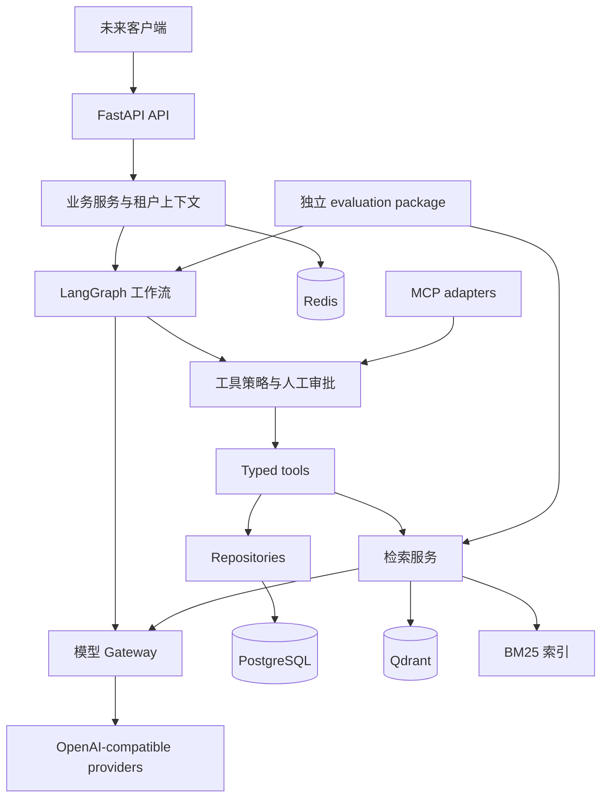

# AgentOpsHub Architecture

Enterprise AI Agent Platform — 企业技术支持 / IT Support 场景。

## 1. 状态与边界

当前实现范围为 **Phase 0–2：Bootstrap、Conda/Persistence、内部 LLM Gateway**。本文区分现有实现与目标设计；
设计中的模块、表、接口和保障不代表已实现。项目是 production-oriented 原型，
已实现 Tenant/Ticket 持久化，尚不具备认证、真实 Agent 或生产部署能力。

约束：原创实现，不复制已有项目代码；Windows 11 + Docker Desktop；Python 3.12+；
16 GB RAM 开发机不强依赖本地大型模型；所有模型访问经 OpenAI-compatible abstraction；
API key 不入库、不写日志、不进 Git；性能或质量数字必须有可重复的实验依据。

## 2. 架构选择

先采用模块化单体，保持清晰接口与单向依赖，之后按真实负载决定拆分。
HTTP API 只处理鉴权上下文、输入校验和协议转换；service 定义业务操作与事务；
repository 执行持久化。Agent orchestration 依赖工具和 gateway 接口，不直接访问数据库。
FastAPI 在组合根 main.py 中装配实际适配器。



图为目标架构。当前 API 提供 /health 与 PostgreSQL /ready；Tenant/Ticket 持久化通过内部 repository 使用，尚无业务 HTTP 路由；内部 Gateway 的模型连接通过离线 transport 验证，未实际调用模型。

## 3. 当前实现

- `create_app(settings=None)`：显式配置快照和 lifespan，无导入时网络 I/O。
- `/health`：liveness，返回 status/service/version；不访问 PostgreSQL、Redis、Qdrant、LLM。
- Pydantic settings：构造参数 > 环境变量 > 根目录 .env > 默认值；无全局缓存，便于隔离测试。
- 配置非法时启动失败，错误文本不包含原始配置输入；生产模式禁用 API 文档页面。
- ASGI middleware：服务端生成 UUID 请求 ID，响应附带 X-Request-ID；不信任传入 ID。
- JSON 日志：UTC 时间、级别、logger、固定事件、请求 ID、路由模板、耗时、状态或异常类型。
  不输出原始路径、query、headers、body、任意日志消息或 exception traceback。
  未知第三方日志转为通用 log 事件；排障信息有限是目前明确的取舍。
- 500 响应不泄漏异常文本，使用 request_id 关联日志；请求上下文在 finally 中清理。
- uv、pytest、Ruff、strict mypy、pre-commit、跨平台脚本和 CI 工作流配置。

## 3a. Phase 1 本地运行时与持久化（已实现）

Conda 环境 agentopshub 提供 Python 3.12；environment.yml 仅声明运行时。
依赖由 pyproject.toml + uv.lock 唯一管理。uv 0.12.10 的 dry-run 和实际安装均验证了
UV_PROJECT_ENVIRONMENT=sys.prefix 配合 --locked --inexact --python=sys.executable
--no-python-downloads 会安装到当前 Conda 环境。--inexact 保留 Conda 引导包，
不会清除锁外残留；依赖移除时需要单独审查。禁止向 base 或系统 Python 同步。
scripts/dev.py 通过当前解释器 -m 调用工具，避免裸 uv run 重新选择 .venv。
旧 .venv 在完整 Phase 0 回归、解释器/包路径和 HTTP 启动验证后移除。
CI 继续使用标准 Python + uv 临时虚拟环境，不依赖 Conda，不写绝对安装路径。

```text
FastAPI lifespan → Database → one AsyncEngine + async_sessionmaker
request/service → Database.transaction() → AsyncSession.begin()
→ TenantRepository / TicketRepository → PostgreSQL
```

Settings 复用 POSTGRES_* aliases，password 是 SecretStr，URL.create 负责安全转义。
缺失密码时 engine 不配置，/health 可用而 /ready 返回 503；配置错误仍启动失败。
创建 engine 不建立连接；连接池只在实际操作时访问 PostgreSQL。pool_pre_ping 检测过期连接，
pool checkout/connect/command timeout 与 readiness 总 deadline 均有显式上限。
关闭 lifespan 时 await engine.dispose()，不是每个请求创建 engine。

事务采用简单服务/请求边界：Database.transaction 使用 async_sessionmaker.begin，正常退出提交，
异常回滚并关闭 session；SQLAlchemy 异常只记录类型后传播，不在 repository 中吞掉约束错误。
Repository create 仅 flush；更新/删除在当前事务内执行，不调用 commit。
TransactionSession 是 FastAPI function-scoped dependency，响应发送前完成事务退出；
同一个 AsyncSession 不得被并发任务共享。未引入额外 Unit of Work 类。

| 模型 | 字段及约束 |
| --- | --- |
| tenants | UUID PK；slug VARCHAR(100) UNIQUE NOT NULL；name VARCHAR(200) NOT NULL；非空白检查；created_at/updated_at TIMESTAMPTZ |
| tickets | UUID PK；tenant_id NOT NULL FK tenants ON DELETE RESTRICT；title VARCHAR(300) NOT NULL 非空白；description TEXT NOT NULL 默认空串；status/priority；两个 TIMESTAMPTZ |

UUID 由 Python uuid4 在 INSERT 时提供，不依赖数据库扩展；原始 SQL 插入需显式给出 UUID。
created_at/updated_at 默认数据库 CURRENT_TIMESTAMP；BEFORE UPDATE trigger 使用 clock_timestamp()
维护 updated_at，覆盖 ORM 和直接 SQL 更新。模型使用 server_onupdate/eager_defaults 读取返回值。
tenant slug 区分大小写；本阶段不添加业务 slug 规范化或状态转换策略。

TicketStatus/TicketPriority 是 Python StrEnum，SQLAlchemy Enum(native_enum=False,
create_constraint=True, validate_strings=True) 保存 enum.value；PostgreSQL VARCHAR + CHECK
阻止直接 SQL 写入未知值。值域是 open/in_progress/resolved/closed 与 low/medium/high/critical。
此策略没有 PostgreSQL enum TYPE 的创建/删除生命周期，降级更直接，存储更可移植；
未来新增/删除枚举值仍需显式约束迁移，删除值前必须迁移已有数据。

Metadata 为 PK/FK/UQ/IX/CHECK 设置确定命名；Ticket 有 ix_tickets_tenant_id 和
ix_tickets_tenant_id_status。外键 RESTRICT 避免删除租户时默默丢失工单。
TicketRepository 不存在 get(ticket_id)；每个读/改/删 SQL 同时过滤 tenant_id 和 ticket_id，
列表过滤 tenant_id 并限制分页；create 强制设置 tenant_id。更新 API 不允许改变归属。
隔离测试先加载 B 的对象到 identity map，再证明 A 不能读取、修改或删除，并用新 session
确认 B 的记录未改变。它是应用级隔离，不是认证授权或 RLS；调用者仍须提供可信租户上下文。

Alembic revision 20260908_01 原创定义表、约束、索引、时间戳触发器；启动不执行 create_all。
env.py 使用 Settings + AsyncEngine/NullPool，run_sync 进入 Alembic 同步操作并 finally dispose。
离线 SQL 不需要凭据。upgrade/current/downgrade/re-upgrade 与 alembic check 已在空测试库验证。
Alembic check 不自动检测 trigger body 漂移，触发器语义由实际 SQL 测试验证。

/health 保持进程 liveness 与既有响应契约。/ready 用 SELECT 1 检查 PostgreSQL，
成功 200，超时/连接失败/未配置 503；返回固定 status/dependencies，不泄漏连接细节。
Redis/Qdrant 不参与应用 readiness。SELECT 1 不代表 schema 已迁移，发布流程必须单独检查迁移。

集成入口创建唯一 Compose project 和 agentopshub_test_<随机 run ID> 数据库，使用随机密码、
回环临时端口、tmpfs，不采用开发 DSN。fixture 校验命名，独占串行清理测试表，允许真实事务提交。
迁移往返与约束/回滚/跨租户测试使用真实 PostgreSQL；之后实际启动 Uvicorn，并停止同一 run-owned
测试容器，验证 /ready 503 与 /health 200。finally 清理仅由本次创建的资源。
运行原始结果保存在忽略的 .artifacts；progress.md 记录真实摘要，不将测试耗时作为性能结论。

Phase 1 之后新增的 Gateway 见第 7 节；Agent runtime、RAG、MCP、认证、frontend、Redis/Qdrant 业务逻辑仍未实现。

## 4. 目标 Agent 工作流（未实现）

```text
intent classification → task planning → knowledge retrieval → tool selection
→ authorization / human approval → tool execution → reflection → final answer
```

LangGraph 状态预计包含 tenant_id、conversation_id、run_id、messages、intent、plan、
工具调用和结果、引用、审批状态、重试计数、token/cost 预算以及最终答案。
迭代次数、总 deadline、工具数量和上下文长度必须有硬限制；reflection 不允许无限循环。
失败统一转为可观测状态；取消请求应传播至模型调用和工具。

PostgreSQL checkpoint 持久化对话、暂停和恢复；短期 memory 是当前对话摘要，长期 memory
只保存经策略允许的用户事实，带来源、租户、过期/删除标记。memory 不能绕过知识库 ACL。
人工审批绑定具体工具名称、参数摘要、版本和调用 ID；修改参数使审批失效。
拒绝、超时、重复恢复和进程重启必须有测试。ticket_create 等有副作用工具使用幂等键，
checkpoint 重放不得重复创建工单。

## 5. 工具与 MCP（未实现）

| Tool | 输入与输出边界 | 权限和执行策略 |
| --- | --- | --- |
| knowledge_search | query/filters/top_k → 带来源的 chunks | 租户与文档 ACL 在检索前过滤 |
| ticket_search | 查询条件 → 工单摘要 | 绑定调用者租户，限制分页和字段 |
| ticket_create | 标题/描述/优先级 → 工单 ID | 人工审批、幂等键、审计事件 |
| sql_query | 受约束查询 → 有界结果 | 只读 DB 角色、表白名单、SQL AST 校验、超时/行数限制 |
| system_status | 允许的服务标识 → 状态 | 禁止任意 URL/命令，防止 SSRF 和 shell 注入 |

统一 Pydantic input/output schema、ToolContext、deadline 与分类错误。
工具声明 risk level 和 required scopes，由服务端策略执行；模型无权给自己授权。
MCP server 后续暴露部分相同工具，复用 service 和授权逻辑；client 只连接配置允许的 server，
校验 schema、限制超时/结果大小、区分可信控制指令和不可信工具输出。

## 6. RAG 与摄取（未实现）

```text
document → parser → normalized document → semantic chunker
→ embedding gateway → vector index + lexical index + metadata

query → BM25 retrieval + dense retrieval → RRF fusion
→ optional reranking → bounded context with citations → generation
```

第一条摄取路径从 UTF-8 text/Markdown 开始，PDF 等 parser 按后续需求添加。
限制文件大小、类型、解析时间和解压规模；正文属于不可信数据。
对象存储接口在本地先落到忽略的 .data/，生产对象存储以后实现。
document/content hash、parser version、chunker version、embedding model/dimension
共同标识索引版本。语义分块先利用标题/段落边界和 token 上限，后续可比较 embedding
语义断点策略。不能凭名称声称已完成 semantic chunking。

PostgreSQL 是文档和索引状态的事实源；Qdrant 保存向量与租户/ACL metadata。
BM25 初期为可重建、按租户/知识库隔离的词法索引接口，具体 tokenizer 必须考虑中英文。
增删、重试、重复上传、部分失败采用版本和幂等任务记录，只有两侧索引都完成才发布 READY；
后续通过 outbox/worker 协调，不声称有跨存储事务。
删除文档必须清理向量、词法索引、缓存和派生数据。

RRF 合并排名，禁止直接相加未经标定的 BM25/向量分数。reranker 为可选接口，初期可用远程
provider 或轻量 CPU 路径；不自动下载大模型。generation 提供来源和不足信息时的拒答。

## 7. LLM Gateway（Phase 2 已实现，未连接真实模型）

业务 → LLMRequest / LLMGateway → LLMProvider Protocol → OpenAICompatibleProvider →
配置的 HTTP endpoint。kind=deepseek/qwen/generic 只是 profile 信息，不产生复制的 vendor 类。
cloud/local/private 仅为部署元数据；route 的有序候选决定跨 provider 行为，无 local/cloud if 分支。
generic 接受 localhost、LAN、私有域名和 HTTPS 云地址；URL 不允许嵌入凭据/query/fragment。
不存在本地运行时 subprocess、权重下载或启动探测；配置只描述已由操作者管理的兼容服务。

选择既有锁定的 httpx2.AsyncClient（HTTPX 系列的直接客户端）而非厂商 SDK，便于注入
MockTransport、控制重试/超时、复用连接并保持依赖体积小。每个启用 profile 一个客户端，
对象创建不发请求，所有客户端由 gateway.close()/应用 lifespan 关闭。TLS 默认验证，
不自动跟随重定向，不隐式继承系统代理；standalone 调用方承担 close 责任。
没有公开 LLM proxy endpoint，也没有 invocation 数据库表。

Settings.llm 接收 GatewayConfig；AGENTOPSHUB_LLM__... 配置可嵌套到 profiles/routes。
profile 声明默认模型、enabled、SecretStr key、key_required、deployment、capabilities、
phase timeouts、单次 deadline、响应缓冲上限和 model pricing。key_required 的判断与部署位置
解耦；命名 DeepSeek/Qwen 配置要求认证，generic 可选择无 key。缺 key 在调用时明确失败，
不阻塞无模型应用启动。LLM 不参与 /ready；其语义仍是 PostgreSQL SELECT 1。

Normalized contracts 使用 Pydantic 和明确枚举：Message、ToolDefinition、ToolCall、
ModelTarget、LLMRequest、ProviderResult、LLMResponse、Usage、CostEstimate、Attempt。
文本及工具参数不出现在 repr；外部 wire JSON 只在 provider 内解析。
消息角色验证工具引用字段；工具 declaration 为 JSON object schema；本阶段不验证/执行真实工具权限。
target.model 可覆盖 profile 默认模型；target.capabilities 允许声明模型级能力，避免假定一个
兼容 endpoint 的所有模型均支持同样功能。没有 multimodal、streaming、embeddings。

HTTP 分别限制 connect/read/write/pool；asyncio.timeout 限制整个单次尝试，以及包含退避、
全部候选的 gateway 总 deadline。计时使用可注入 monotonic/perf_counter；wall time 不用于
延迟相减。调用方取消不重试；整体 deadline 中止时保留已完成/被取消 attempt 元数据。

重试矩阵：连接/传输错误、timeout、HTTP 408、429、5xx 可重试；400、401、403、404、409、
其他非暂时 HTTP 错误不重试。配置、能力、响应格式、structured validation 错误直接报告。
重试 attempt 上限含首次调用，指数退避 capped full jitter；sleep/random 可注入。
Retry-After 仅支持有限非负秒数且受 max_delay 限制，暂不解析 HTTP-date。
没有 SDK 内部重试，因此没有隐藏的双重重试层。重试可能再次消耗 provider 费用。

fallback 按 route 顺序逐个执行，每个候选先用尽有界重试。默认仅临时错误可进入下一候选；
401/403 默认立即报告 AuthenticationError，只有 route.fallback_on_authentication=true 才
允许转到其他候选，绝不重试同一认证失败目标。配置错误不会被 fallback 悄悄掩盖。
route 是允许的数据传递边界，local→cloud 必须显式配置，不存在自动隐私推断。
所有 eligible candidates 失败抛 GatewayExhaustedError；attempts 记录 sequence、provider、
model、deployment、target 内 attempt number、outcome、语义错误类别、安全 HTTP status、
单调时钟 latency、retryable。不含 URL、headers、prompt 或模型正文。

usage 只采用 provider 计数；缺失保留 None，仅在两个分量均存在时推导缺失 total。
cost = input_tokens / 1_000_000 * input_per_million + output_tokens / 1_000_000 * output_per_million，
使用 Decimal 和配置币种，可记录 price effective_date。没有价格或完整计数时 unknown，
包括本地模型；仅估算成功响应，失败尝试和整次调用的完整账单仍未知。
没有动态路由、Redis 限流、预算预留或持久化费用账本，均不在 Phase 2 范围。

能力模型仅 tool_calling/json_mode/structured_output，默认 false。结构化输出优先 native
json_schema，或在 json_mode 下附带 schema 指令；无声明支持则 UnsupportedCapabilityError。
最终严格拒绝非法 JSON（包括 NaN/Infinity），再使用 response_model.model_validate_json(strict=True)。
格式/schema/截断错误为 StructuredOutputError，不 eval、不自动修复或重生成。
结构化校验在 HTTP normalization 成功后进行，因此 error.attempts 可包含 HTTP success。

既有 JsonFormatter allowlist 增加 llm_attempt/llm_result，记录目标身份、序号、耗时、
错误类别、计数和估计费用；不记录默认 payload/header/原始异常。模型标签使用配置值，
provider request ID 经过格式与 key 排除检查；HTTP request UUID context 可继承或显式传入。
所有 transport 失败映射固定语义异常并抑制原始异常展示。生成文本不出现在 repr。

验证：MockTransport 经过真实 adapter HTTP 路径，阻止默认模型网络 transport；覆盖云/私有/
localhost、认证可选性、重试与有序 fallback、deadline/cancellation、解析、结构化和泄漏测试。
没有真实云/API/local inference 测试或 GPU benchmark；profile 兼容性不能被解读为任何实时
厂商模型已验证支持全部声明特性。Qwen 的 region/workspace URL 必须来自实际账户配置。

开发机检测 RTX 5060 Ti，nvidia-smi 报告 8151 MiB 专用 framebuffer，系统约 16 GB RAM；
不把 Windows shared GPU memory 当作额外专用 VRAM。当前 cloud API 优先，不依赖本地推理。
后续本地阶段以较小量化模型为候选，实际可用规模由 VRAM/质量/延迟测量决定；
不在此宣称支持模型大小、tokens/sec、TTFT 或最大上下文。

## 8. 后续数据与安全设计（除 Phase 1 模型外未实现）

PostgreSQL 预计保存 tenants、users、knowledge_bases、documents、chunks、ingestion_jobs、
conversations、messages、agent_runs、tool_calls、approvals、tickets、usage_events、audit_events。
其中 Tenant/Ticket、SQLAlchemy 2 async sessions、Alembic 已在 Phase 1 落地；其他数据模型仍为规划。
tenant_id 不由模型或请求体任意指定；来自已验证身份，并贯穿 repository、检索过滤、缓存 key。
后续验证 RLS 作为纵深防御，RBAC/ACL 测试覆盖跨租户拒绝路径。

Redis 保存短期缓存、限流计数和幂等辅助信息；不是审批或费用账本的唯一持久化来源。
审计记录只保留必要摘要，敏感数据需有保留期和删除流程。

prompt injection protection 是多层约束：不可信文档/工具输出与系统指令分离、检索 ACL、
工具参数验证、服务端授权、审批以及 adversarial eval。无法承诺绝对阻止所有 prompt injection。
后续增加文件上传限制、SSRF 防护、输出 schema 验证、敏感信息检测与超预算终止。

## 9. Observability 与评测（除基础 JSON 日志外未实现）

未来 tracing 使用 OpenTelemetry span 贯穿 API/graph/tool/retrieval/gateway/DB；
用 request_id/run_id 关联，正文采集默认关闭。指标包括真实请求延迟、错误分类、重试次数、
token usage 和已定价 cost。不得把估计、预算或单元测试运行时间描述为系统吞吐能力。

独立 evaluation package 消费公开服务接口；标注数据与应用源码分离。
Recall@K = top K 命中相关文档数 / 该 query 的全部相关文档数；MRR = 第一个相关结果
排名倒数的 query 均值；Hit Rate@K = 至少命中一个相关结果的 query 比例。
文档与 chunk 粒度需在 manifest 中固定并去重；无 gold label 的 query 不能悄悄当零分。
answer relevance 可人工评分或显式标记 LLM judge，并记录 rubric、judge model/prompt；
它不是客观真值，也不等同于 groundedness。

dense / hybrid / hybrid+reranking 比较固定语料、query split、embedding、K、硬件及配置，
记录 git SHA、lockfile hash、数据 hash、seed、warmup、重复次数、并发、计时边界、原始输出和费用。
latency 报告样本数量及分位数的定义，失败样本保留；README 数字须能追溯到运行 artifact。
目前没有 benchmark 数据、检索结果或性能声明。

## 10. 本地与生产边界

当前 API 在 Windows 主机的 Conda 环境运行；Compose 仅管理开发 PostgreSQL/Redis/Qdrant。
服务绑定 127.0.0.1，named volumes 位于 Docker Linux 存储，避免 Qdrant Windows bind mount 问题。
内存上限总计 2 GiB，属于配置值，**不是实测占用**；还需计算 Docker VM、OS、IDE、Python 开销。
不要求 GPU 或 LLM key。Qdrant readiness 由 Python host probe 检查，无 curl/wget 镜像假设。
Linux engine 必须可用；启动失败不影响纯 API 单元测试。

生产上线仍需身份与租户隔离、TLS、存储鉴权、备份恢复、迁移、镜像漏洞与 digest 审查、
网络策略、worker 生命周期、可观测性后端、负载验证和运维手册。开发 Compose 不是生产部署清单。

## 官方参考（仅借鉴接口与运维思想）

- [FastAPI lifespan](https://fastapi.tiangolo.com/advanced/events/)
- [Pydantic settings](https://docs.pydantic.dev/latest/concepts/pydantic_settings/)
- [uv lock/sync](https://docs.astral.sh/uv/concepts/projects/sync/)
- [Docker Compose services](https://docs.docker.com/reference/compose-file/services/)
- [Qdrant storage](https://qdrant.tech/documentation/installation/)
