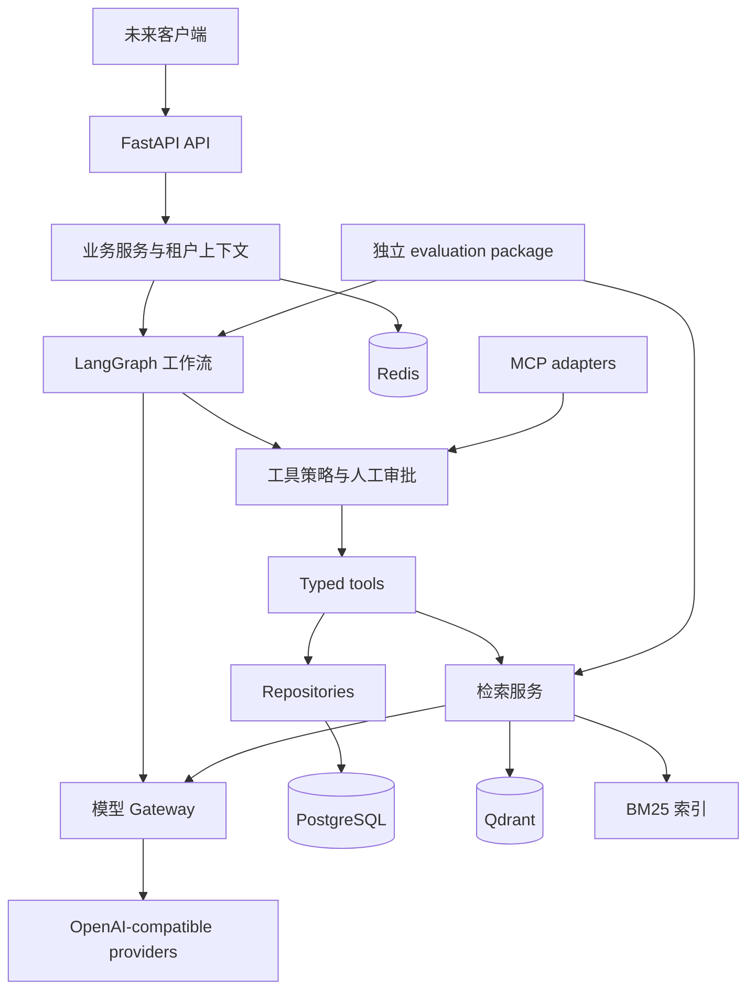

# AgentOpsHub Architecture

Enterprise AI Agent Platform — 企业技术支持 / IT Support 场景。

## 1. 状态与边界

当前仅实现 **Phase 0: Architecture & Bootstrap**。本文区分现有实现与目标设计；
设计中的模块、表、接口和保障不代表已实现。项目是 production-oriented 原型，
尚不具备认证、持久化、真实 Agent 或生产部署能力。

约束：原创实现，不复制已有项目代码；Windows 11 + Docker Desktop；Python 3.12+；
16 GB RAM 开发机不强依赖本地大型模型；所有模型访问经 OpenAI-compatible abstraction；
API key 不入库、不写日志、不进 Git；性能或质量数字必须有可重复的实验依据。

## 2. 架构选择

先采用模块化单体，保持清晰接口与单向依赖，之后按真实负载决定拆分。
HTTP API 只处理鉴权上下文、输入校验和协议转换；service 定义业务操作与事务；
repository 执行持久化。Agent orchestration 依赖工具和 gateway 接口，不直接访问数据库。
FastAPI 在组合根 main.py 中装配实际适配器。



图为目标架构。当前 API 仅提供 /health，尚未连接图中的存储或模型。

## 3. 当前实现

- `create_app(settings=None)`：显式配置快照和 lifespan，无导入时网络 I/O。
- `/health`：liveness，返回 status/service/version；不访问 PostgreSQL、Redis、Qdrant、LLM。
- Pydantic settings：构造参数 > 环境变量 > 根目录 .env > 默认值；无全局缓存，便于隔离测试。
- 配置非法时启动失败，错误文本不包含原始配置输入；生产模式禁用 API 文档页面。
- ASGI middleware：服务端生成 UUID 请求 ID，响应附带 X-Request-ID；不信任传入 ID。
- JSON 日志：UTC 时间、级别、logger、固定事件、请求 ID、路由模板、耗时、状态或异常类型。
  不输出原始路径、query、headers、body、任意日志消息或 exception traceback。
  未知第三方日志转为通用 log 事件；排障信息有限是目前明确的取舍。
- 500 响应不泄漏异常文本，使用 request_id 关联日志；请求上下文在 finally 中清理。
- uv、pytest、Ruff、strict mypy、pre-commit、跨平台脚本和 CI 工作流配置。

## 4. 目标 Agent 工作流（未实现）

```text
intent classification → task planning → knowledge retrieval → tool selection
→ authorization / human approval → tool execution → reflection → final answer
```

LangGraph 状态预计包含 tenant_id、conversation_id、run_id、messages、intent、plan、
工具调用和结果、引用、审批状态、重试计数、token/cost 预算以及最终答案。
迭代次数、总 deadline、工具数量和上下文长度必须有硬限制；reflection 不允许无限循环。
失败统一转为可观测状态；取消请求应传播至模型调用和工具。

PostgreSQL checkpoint 持久化对话、暂停和恢复；短期 memory 是当前对话摘要，长期 memory
只保存经策略允许的用户事实，带来源、租户、过期/删除标记。memory 不能绕过知识库 ACL。
人工审批绑定具体工具名称、参数摘要、版本和调用 ID；修改参数使审批失效。
拒绝、超时、重复恢复和进程重启必须有测试。ticket_create 等有副作用工具使用幂等键，
checkpoint 重放不得重复创建工单。

## 5. 工具与 MCP（未实现）

| Tool | 输入与输出边界 | 权限和执行策略 |
| --- | --- | --- |
| knowledge_search | query/filters/top_k → 带来源的 chunks | 租户与文档 ACL 在检索前过滤 |
| ticket_search | 查询条件 → 工单摘要 | 绑定调用者租户，限制分页和字段 |
| ticket_create | 标题/描述/优先级 → 工单 ID | 人工审批、幂等键、审计事件 |
| sql_query | 受约束查询 → 有界结果 | 只读 DB 角色、表白名单、SQL AST 校验、超时/行数限制 |
| system_status | 允许的服务标识 → 状态 | 禁止任意 URL/命令，防止 SSRF 和 shell 注入 |

统一 Pydantic input/output schema、ToolContext、deadline 与分类错误。
工具声明 risk level 和 required scopes，由服务端策略执行；模型无权给自己授权。
MCP server 后续暴露部分相同工具，复用 service 和授权逻辑；client 只连接配置允许的 server，
校验 schema、限制超时/结果大小、区分可信控制指令和不可信工具输出。

## 6. RAG 与摄取（未实现）

```text
document → parser → normalized document → semantic chunker
→ embedding gateway → vector index + lexical index + metadata

query → BM25 retrieval + dense retrieval → RRF fusion
→ optional reranking → bounded context with citations → generation
```

第一条摄取路径从 UTF-8 text/Markdown 开始，PDF 等 parser 按后续需求添加。
限制文件大小、类型、解析时间和解压规模；正文属于不可信数据。
对象存储接口在本地先落到忽略的 .data/，生产对象存储以后实现。
document/content hash、parser version、chunker version、embedding model/dimension
共同标识索引版本。语义分块先利用标题/段落边界和 token 上限，后续可比较 embedding
语义断点策略。不能凭名称声称已完成 semantic chunking。

PostgreSQL 是文档和索引状态的事实源；Qdrant 保存向量与租户/ACL metadata。
BM25 初期为可重建、按租户/知识库隔离的词法索引接口，具体 tokenizer 必须考虑中英文。
增删、重试、重复上传、部分失败采用版本和幂等任务记录，只有两侧索引都完成才发布 READY；
后续通过 outbox/worker 协调，不声称有跨存储事务。
删除文档必须清理向量、词法索引、缓存和派生数据。

RRF 合并排名，禁止直接相加未经标定的 BM25/向量分数。reranker 为可选接口，初期可用远程
provider 或轻量 CPU 路径；不自动下载大模型。generation 提供来源和不足信息时的拒答。

## 7. Model gateway（未实现）

定义自有 typed request/response/protocol，适配 OpenAI-compatible chat 与 embeddings API。
DeepSeek、Qwen 和其他 provider 通过配置切换。compatible 不表示功能相同：适配器声明
tool calling、structured output、streaming、embedding 能力，不支持的功能应明确报错。
reranking 如无统一兼容端点，也必须经过同一 gateway 中的独立协议适配器。

请求设置总 deadline 和单次 timeout。仅对可重试传输失败、429、特定 5xx 使用有界退避
与 jitter，并尊重 Retry-After；鉴权错误、schema 错误不得盲目重试。fallback 有显式允许列表、
能力检查和总预算；数据驻留策略可能禁止跨 provider fallback。流式输出后不得悄悄拼接另一个模型。
限流和并发限制区分 tenant/provider；token accounting 使用 provider usage，缺失则标记估算。
成本使用带生效日期和币种的配置价目表，未配置价格显示 unknown，不能显示成免费。
API key 使用 SecretStr/密钥管理适配器，只在发送认证头时解包。

## 8. 数据与安全设计（未实现）

PostgreSQL 预计保存 tenants、users、knowledge_bases、documents、chunks、ingestion_jobs、
conversations、messages、agent_runs、tool_calls、approvals、tickets、usage_events、audit_events。
SQLAlchemy 2 async sessions 按业务事务管理，Alembic 为 schema 变更入口。
tenant_id 不由模型或请求体任意指定；来自已验证身份，并贯穿 repository、检索过滤、缓存 key。
后续验证 RLS 作为纵深防御，RBAC/ACL 测试覆盖跨租户拒绝路径。

Redis 保存短期缓存、限流计数和幂等辅助信息；不是审批或费用账本的唯一持久化来源。
审计记录只保留必要摘要，敏感数据需有保留期和删除流程。

prompt injection protection 是多层约束：不可信文档/工具输出与系统指令分离、检索 ACL、
工具参数验证、服务端授权、审批以及 adversarial eval。无法承诺绝对阻止所有 prompt injection。
后续增加文件上传限制、SSRF 防护、输出 schema 验证、敏感信息检测与超预算终止。

## 9. Observability 与评测（除基础 JSON 日志外未实现）

未来 tracing 使用 OpenTelemetry span 贯穿 API/graph/tool/retrieval/gateway/DB；
用 request_id/run_id 关联，正文采集默认关闭。指标包括真实请求延迟、错误分类、重试次数、
token usage 和已定价 cost。不得把估计、预算或单元测试运行时间描述为系统吞吐能力。

独立 evaluation package 消费公开服务接口；标注数据与应用源码分离。
Recall@K = top K 命中相关文档数 / 该 query 的全部相关文档数；MRR = 第一个相关结果
排名倒数的 query 均值；Hit Rate@K = 至少命中一个相关结果的 query 比例。
文档与 chunk 粒度需在 manifest 中固定并去重；无 gold label 的 query 不能悄悄当零分。
answer relevance 可人工评分或显式标记 LLM judge，并记录 rubric、judge model/prompt；
它不是客观真值，也不等同于 groundedness。

dense / hybrid / hybrid+reranking 比较固定语料、query split、embedding、K、硬件及配置，
记录 git SHA、lockfile hash、数据 hash、seed、warmup、重复次数、并发、计时边界、原始输出和费用。
latency 报告样本数量及分位数的定义，失败样本保留；README 数字须能追溯到运行 artifact。
目前没有 benchmark 数据、检索结果或性能声明。

## 10. 本地与生产边界

Phase 0 API 在 Windows 主机运行；Compose 仅管理开发 PostgreSQL/Redis/Qdrant。
服务绑定 127.0.0.1，named volumes 位于 Docker Linux 存储，避免 Qdrant Windows bind mount 问题。
内存上限总计 2 GiB，属于配置值，**不是实测占用**；还需计算 Docker VM、OS、IDE、Python 开销。
不要求 GPU 或 LLM key。Qdrant readiness 由 Python host probe 检查，无 curl/wget 镜像假设。
Linux engine 必须可用；启动失败不影响纯 API 单元测试。

生产上线仍需身份与租户隔离、TLS、存储鉴权、备份恢复、迁移、镜像漏洞与 digest 审查、
网络策略、worker 生命周期、可观测性后端、负载验证和运维手册。开发 Compose 不是生产部署清单。

## 官方参考（仅借鉴接口与运维思想）

- [FastAPI lifespan](https://fastapi.tiangolo.com/advanced/events/)
- [Pydantic settings](https://docs.pydantic.dev/latest/concepts/pydantic_settings/)
- [uv lock/sync](https://docs.astral.sh/uv/concepts/projects/sync/)
- [Docker Compose services](https://docs.docker.com/reference/compose-file/services/)
- [Qdrant storage](https://qdrant.tech/documentation/installation/)
